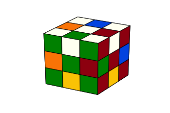
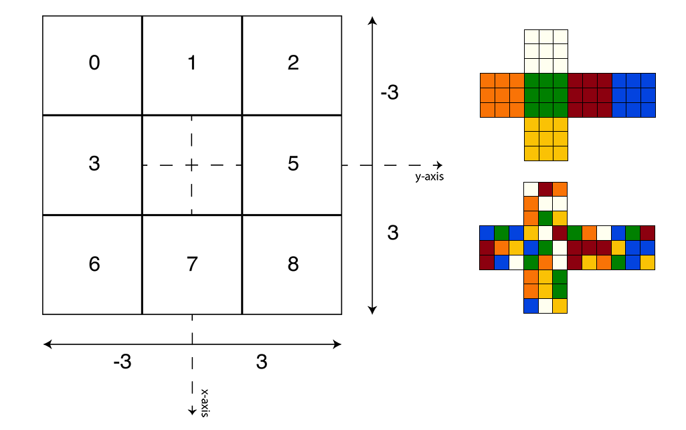
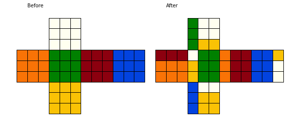
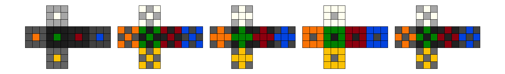

# Exploring the Model's Code Implementation:
   
**[For Full Source Code and Notebook Demos see GitHub Repo](https://github.com/ajdonich/rubiks-cube)**

For the purposes of demonstration, the repository contains a set IPython/Jupyter Notebooks in the *notebooks* directory that walk through basic functionality and provide code samples for understanding and using the project’s underlying classes.   

Classes are divided into Models (for cube representation, movement and display) and Solvers (for solution logic and supplements such tree node and solution state classes). These classes are located in the *rubiks/model* and *rubiks/solver* directories respectively. This doc provides specific descriptions of the model classes. For more detailed understanding of the solver classes, please refer to the notebook demonstrations and solver python files directly.

Note that the repository also contains a *rubiks/legacy* directory and a *sandbox* directory, these are for historical storage and my working files only, they are not mantained or manicured for public use and are unnecessary for running notebooks or other classes in the repo.  


## VectorCube.py:   
**[For Demo see Notebook 1: Intro-Cube-View](https://github.com/ajdonich/rubiks-cube/blob/master/notebooks/Nb1_Intro_Cube_View.ipynb)**

To model the cube, I eventually chose to interpret it as a bona fide physical object in 3D space, by which I mean, each facelet has  an actual 3D spatial position. Technically in the full cube matrix (i.e. the VectorCube field: *facelet_matrix*, a 5x54 NumPy array), each of the 54 facelets is a 5D column vector that holds a color-value[<sup>1</sup>](#footnotes) [WHITE_CB, ORANGE_CB, GREEN_CB, RED_CB, BLUE_CB, YELLOW_CB], a side-index [0,1,2,3,4,5,6,7 or 8], and the 3D spatial position-vector, with positional values from the set [-3,-2,-1,0,1,2, or 3].   

The cube is defined with this size (i.e. 6x6) to assure that all 54 facelets can be defined with a unique spatial vector made entirely of integers that is closed (remains integers) under cube moves/rotations (i.e. positional vectors never suffer from accumulation of floating point error).

Exectuting a (local) cube move/rotation is simply a function call: *cube.rotate(move)*. There are 18 possible moves (6-sides * 3-rotations [90, -90, or 180 degrees]). Underlying, these (local) rotations are specified as tuples: (color-value, rotation-angle), such as (WHITE_CB, 90). These move tuples map to actual 3x3 spatial rotation matrices that are applied to facelet positional vectors using matrix multiplication operations.   

Note that the center facelets of each side are positionally fixed (e.g. the WHITE center facelet is always at postion [0,0,3]), and thus the relationship of the sides are fixed; the WHITE side is always opposite the YELLOW side, etc. This is to say, the cube and (local) moves are defined relative to as fixed local coordinate system, which is oriented such that:

+ GREEN and BLUE sides rotate about the x̂-axis  
+ RED and ORANGE sides rotate about the ŷ-axis   
+ WHITE and YELLOW sides rotate about the ẑ-axis   
&NewLine;

**Figure 1:**   
> *LEFT: Dimensional depiction of the cube's WHITE side (9 facelets, all with color-value of WHITE_CB and side-index values shown).*   
> *RIGHT: The default (and only) projection orientation (note that center facelets never moves).*


With the help of the diagram above, one can derive (for example, as the other sides are derived similarly) the nine 5D-vectors for the solved WHITE side as:

| Facelet | Column Vector |
| :------ | ----------- |
| WHITE-facelet-0 | [ 1  0 -2 -2  3]   |
| WHITE-facelet-1 | [ 1  1 -2  0  3]   |
| WHITE-facelet-2 | [ 1  2 -2  2  3]   |
| WHITE-facelet-3 | [ 1  3  0 -2  3]   |
| WHITE-facelet-4 | [ 1  4  0  0  3]   |
| WHITE-facelet-5 | [ 1  5  0  2  3]   |
| WHITE-facelet-6 | [ 1  6  2 -2  3]   |
| WHITE-facelet-7 | [ 1  7  2  0  3]   |
| WHITE-facelet-8 | [ 1  8  2  2  3]   |

## SMAdapter.py:   
**[For Demo see Notebook 1: Intro-Cube-View](https://github.com/ajdonich/rubiks-cube/blob/master/notebooks/Nb1_Intro_Cube_View.ipynb)**
  
The generally accepted default notation for Rubik's cube moves is called Singmaster Notation. Using the SMAdapter class (which is implemented as essentially a VectorCube wrapper class) all Singmaster Notation moves can be applied to a VectorCube including full cube rotations, slice turns and double layer turns. These are applied as global rotations that can be mixed with local rotation moves. The full set of supported Singmaster notation is:


| Move Type | Singmaster Notation |
| :------ | :----------- |
| Clockwise face rotations:   | **[U, L, F, R, B, D, U2, L2, F2, R2, B2, D2]** |
| Counterclockwise face:      | **[U', L', F', R', B', D']** |
| Slice turns:                | **[M, M', E, E', S, S', M2, E2, S2]** |
| Double layer turns:         | **[u, l, f, r, b, d, u2, l2, f2, r2, b2, d2]** |
| Inverse double layer turns: | **[u', l', f', r', b', d']** |
| Whole cube rotations:       | **[X, X', Y, Y', Z, Z', X2, Y2, Z2]** |   

**Figure 2:** *Singmaster move code snippet and output, including retrieval of corresponding local moves. Note that only 4 local moves are needed to represent this 7 SM move sequence*    
```
corresponding_local_moves = [] 
some_singmaster_moves = ['Y2', 'F2', 'S2', "Y'", 'X2', 'z', "B'"]

cube = VectorCube()
cube_adpt = SMAdapter(cube)

# Add a view for displaying
view = CubeView(cube)
view.push_snapshot(caption="Before")

for sm_move in some_singmaster_moves: 
    cube_adpt.rotate_singmaster(sm_move, corresponding_local_moves)

print("Local moves:", [f'({color_letr(mv[0])}:{mv[1]})' for mv in corresponding_local_moves])
view.push_snapshot(caption="After").draw_snapshots()
```
```Local moves: ['(B:180)', '(G:180)', '(B:180)', '(O:-90)']```
   


## CfopCube.py and DirectCube.py:  
**For Demos see Notebooks 3 & 4:  [CFOP Algorithm](https://github.com/ajdonich/rubiks-cube/blob/master/notebooks/Nb3_CFOP_Algorithm.ipynb) & [Cycles and Entropy](https://github.com/ajdonich/rubiks-cube/blob/master/notebooks/Nb4_Cycles_Entropy.ipynb)**

From the standpoint of class structure, VectorCube is a cube base class. Both CfopCube and DirectCube derive from it, CfopCube containing additional fields for the CFOP solver, and DirectCube storing an additional set of directional vectors for each facelet to facilitate the Dancing Facelet heuristic.

## CubeView.py:   
**[For Demo see Notebook 1: Intro-Cube-View](https://github.com/ajdonich/rubiks-cube/blob/master/notebooks/Nb1_Intro_Cube_View.ipynb)**

Finally, display of the cube is handled almost entirely by the CubeView class, which executes all displays using Matplotlib. It can display both 2D projections or 3D displays of the cube. Move sequences can be displayed as (gridded) series of 2D projections or as animated versions of the 3D display. Index filters can also be provided in some CubeView functions to limit which cube facelets get displayed in full color (or in 3D, if they’re displayed at all). There a several pre-defined index arrays contained in VectorCube, or they may be created uniquely at runtime. The following snippet and output demonstrate use of index filtering:   

&NewLine;   
**Figure 3:** *Example snippet and output using index color-filtering feature available CubeView class* 
```
view = CubeView(VectorCube())

view.push_snapshot(flet_idx=VectorCube._centers)
view.push_snapshot(flet_idx=VectorCube._order_cn_cnt)
view.push_snapshot(flet_idx=VectorCube._order_ed_cnt)
view.push_snapshot(flet_idx=VectorCube._order_cn_ed)
view.push_snapshot(flet_idx=VectorCube._order_ed)

view.draw_snapshots()
```
   

Generating 3D animations can be accomplished simply by bounding any set of cube moves within calls to CubeView's *record_moves* function, and then invoking an IPython.display HTML translation (please see notebooks for example animations):   
```
# Begin recording
view.record_moves()

# Any set of cube moves/rotations and other code here

# Stop recording
view.record_moves(stop_recording=True)

# Tranlate to HTML and display in notebook
HTML(view.get_animation_3d().to_jshtml())
```
_____

<a id="footnotes"></a>

#### Footnotes:  
<sup>1</sup> VectorCube defines a set of color-value constants:
```
# COLORS/SIDES:
WHITE_CB, W  = 1, 1
ORANGE_CB, O = 2, 2
GREEN_CB, G  = 3, 3
RED_CB, R    = 4, 4
BLUE_CB, B   = 5, 5
YELLOW_CB, Y = 6, 6
```
