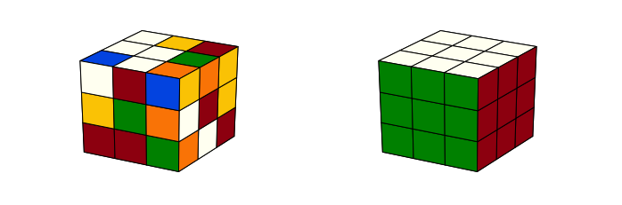
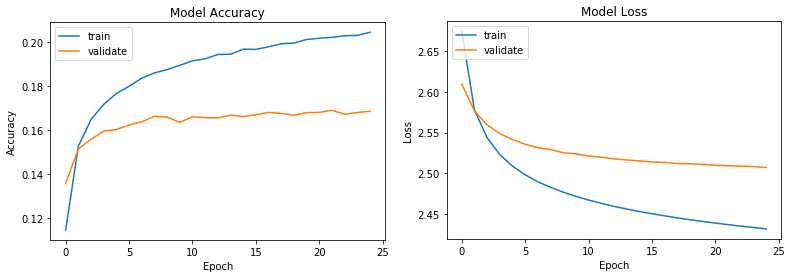
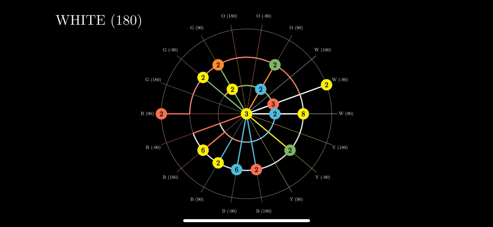
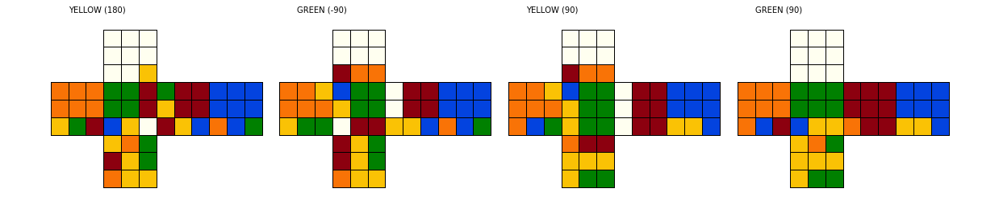
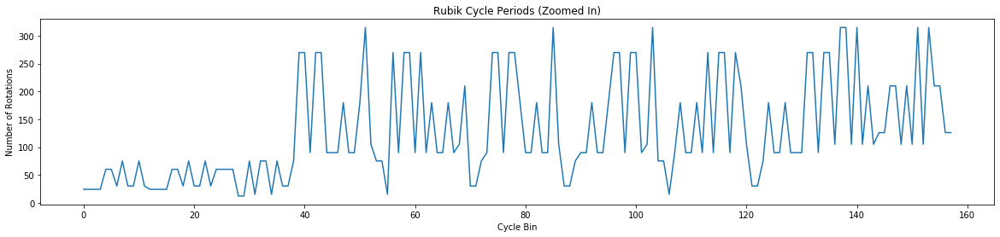

# My Search for a Novel Algorithmic Solution to Rubik’s Cube

This repository contains a collection of Python classes and notebooks for exploring algorithmic solutions to Rubik’s cube. I began the project to experiment with Deep Reinforcement Learning, but I think my most interesting results came from abstracted notions of entropy and periodicity applied to the cube. I originally considered a sliding puzzle for the project, but then opted for Rubik’s cube for some added challenge, which it certainly delivered. After six months of diligent effort, I am yet to develop a novel method that can fully crack it, not to mention that I often felt a sense that a solution was just around the corner, making the puzzle as fun as it was vexing.

This article describes the solution strategies and results I've traversed thus far (chronologically, despite some arguably ill-conceived, hindsight is 20/20, directions). For discussion of the actual class implementations in the repository, especially those that represent and display the cube (i.e. models and views), please navigate to the Code Docs article.

_____

## Strategy #1: Neural Networks (NN) and Deep Reinforcement Learning (DRL)   
**[For Demo see Notebook 2: Neural Networks](https://github.com/ajdonich/rubiks-cube/blob/master/notebooks/Nb2_Neural_Networks.ipynb)**

My initial direction for solving the cube was to emulate a DRL strategy akin to that developed by DeepMind with its AlphaGo[1](#footnotes) program. This same essential strategy is also described by a group out of UC Irvine in their paper, *Solving the Rubik’s Cube Without Human Knowledge.*[2](#footnotes) The strategy gist is to combine a NN with a Monte Carlo Tree Search (MCTS), with implementations varying in NN architecture, training methodology, specifics of tree expansion/rollout, etc.

Though I eventually made extensive and (moderately) effective use of the tree search, I quickly realized that conventional DRL/RL is not ideally suited for Rubik’s cube because it, RL, depends on initially random moves to produce enough successful outcomes for learning to begin. But unfortunately, a 3x3 cube has 43 quintillion (10^18) possible permutations and **one** solution.[3](#footnotes) Ever solving it with initially random moves is highly improbable to say the least. 

This led me to pursue training a NN independently, potentially to drop into DRL afterword, but primarily just to evaluate whether a viable statistical relationship between cube permutations and solution sequences could be established. To generate a training and validation dataset, I used the fact that a valid solution sequence to a cube can be obtained by simply reversing the moves used to scramble it, and if the scramble involves 20 or fewer (non-redundant) moves, one can also probably safely assume the solution is relatively efficient.[4](#footnotes)

But despite experimenting with a variety of NN architectures and formats for NN input (for example calculating and using certain vector relationships between cube-facelets[5](#footnotes) as input rather than using straight facelet positions), I was unable to train a network that generalized beyond approx. 20% accuracy to a validation set (as depicted in graphs below). I could overfit training data to ~60% accuracy and suspected such network ‘memorization’ could continue with a large enough network, which, if inserted into DRL, could theoretically solve cubes whenever the tree-search found a memorized permutation. I’m not clear whether learning could take hold from there, but regardless, I did not continue with that exploration[6](#footnotes) given my limiting computing power to train a very large network.   

**Figure 1:** *The unfortunately dismal training results using Dance Heuristic inputs into a 5-layer, full-connected policy network*   
&NewLine;   
   

## Strategy #2: Heuristic-Guided, Upper-Confidence-Bound (UCB) Tree Search   
**[For Demo see Notebook 1: Intro-Cube-View](https://github.com/ajdonich/rubiks-cube/blob/master/notebooks/Nb1_Intro_Cube_View.ipynb)**

My next effort was dedicated to honing a UCB tree search.[7](#footnotes) I began by developing a heuristic function I called Minimum-Distance-Home (see Figure 2 below). A characteristic of the cube is that any given facelet can, independently, be returned to its solved position in at most 2 moves if it is a corner facelet, or 3 moves if it is an edge. The overall heuristic then, is the sum over all facelets of this number-of-moves-to-solved (i.e. 0, 1, 2 or 3) for a given cube permutation.[8](#footnotes) 

On the positive side, I was fairly happy with the performance of my UCB tree search after optimizing my cube class representation to be based almost entirely on NumPy arrays and matrix operations. Still, the size of the search space was too much. Though I was usually able to solve cubes scrambled out 5-6 moves, beyond that the failure rates spiked.   

**Figure 2:** *Still from Minimum-Distance-Home (MDH) animation 
(click to [watch video](https://youtu.be/Ges0wz5SbOM)). 
Depicts the MDH heuristic as cubes are scrambled and solved/reverse-scrambled.*
> 1. *The three rings of the target shaped diagram represent the number (0 to 3) of moves a facelet requires to return to its home/solved position (the center of the target representing home/solved)*  
> 2. *The 18 spokes represent possible cube moves (in Half-Turn-Metric, notated by face-color and rotation-angle)*   
> 3. *The small, colored, numbered circles represent the facelets themselves, and the thicker lines represent viable move sequences/trajectories each facelet could traverse to return home*[9](#footnotes)   

## Strategy #3: Fridrich’s (CFOP) Human Speedcubing Algorithm   
**[For Demo see Notebook 3: CFOP Algorithm](https://github.com/ajdonich/rubiks-cube/blob/master/notebooks/Nb3_CFOP_Algorithm.ipynb)**

I focused my efforts next on integrating human-understanding/strategy into a machine-learning algorithm.[10](#footnotes) The most popular speedcubing method: CFOP, solves the cube in four, layer-based steps, specifically: 1) the Cross, 2) the First 2 Layers, 3) Orient the Last Layer, and 4) Permute the Last Layer.[11](#footnotes) Thus, an obvious approach seemed to be to develop a solver that mimicked a human speedcuber and then use it to generate a training dataset for each step.[12](#footnotes)  

There are approximately 80, explicitly defined move sequences for the final OLL and PLL steps; challenging for a human to memorize, but essentially trivial to apply in software. The Cross and F2L steps, however, are not as strictly defined, leading me to adapt my tree search to handle them. After a few weeks of work, I finally succeed in algorithmically solving my first cube! Unfortunately, even searching just through the F2L solution was surprisingly complex.

Typically search trees would contain 5-15 million nodes, 40-45% of which would be visited. Searches would usually converge in 7-15 (at times up to 20) minutes to solutions that involved 50-70 moves, though some cubes would fail. The large convergence time required per cube thwarted my hopes of ever generating an adequately sized training dataset in a reasonable time frame. Furthermore, the code started to become fairly convoluted and the entire solving strategy piecemeal, in my opinion, as I added the many layers of human-like solving logic necessary to facilitate convergence.

**Figure 3:** *Example output of CFOP algorithm solving last few moves of an F2L stage*   
&NewLine;   

## Strategy #4: Entropy, Sequence Periodicity and Dancing Facelets
**[For Demo see Notebook 4: Cycles and Entropy](https://github.com/ajdonich/rubiks-cube/blob/master/notebooks/Nb4_Cycles_Entropy.ipynb)**

Unsatisfied with my piecemeal solution thus far and, coincidentally, studying the writings of theoretical physicist, David Bohm, particularly concerning distinctions between creative versus mechanistic modes, I began to develop some tangential experiments and visualizations of the cube. These included creating some atypical video animations of the cube as it was scrambled and then solved and examining a cube’s fundamental periodic/repeatable move sequences.[13](#footnotes)  

**Figure 4:** *Graph of rotational periods for the first 160 fundamental two-sided rotation sequences*   
&NewLine;   

I noticed in an animation, in contrast to human strategies, highly efficient solutions rarely move facelets to their solved/home positions, right up until the last few moves, when suddenly the whole cube clicks together. This inspired me to create an “Entropy/Order” heuristic intended to measure a kind of entropy or level of order/disorder of a cube permutation. I awarded 1 point to any solution-pair of facelets[14](#footnotes) that achieved a side-by-side orientation, regardless of where that occurred on the overall surface of the cube, then summed this reward across all facelets.[15](#footnotes)  

As I worked to integrate these new ideas into my tree search, I was surprised to find almost by accident, a short segment of test code was nearly solving the cube by itself. It simply iterated through periodic move sequences and maximized the Order heuristic. I explored this direction further, developing a more sophisticated heuristic I called Dancing Facelets.[16](#footnotes) It could collapse to the Order heuristic if so configured or could measure more nuanced relationships between facelets such as angular measurements or triad relationships.

I continued to explore methods of integrating these new components into my tree search or progress with them independently. And I continued to “nearly” solve the cube, but evidently appearances are deceiving with Rubik’s cube; my attempts were clearly converging to local minimums and it wasn’t entirely clear how close or far away true solutions remained. Thus, despite some intriguing results, I’m still at least one more step from victory. Touché, Mr. Rubik.

_____

#### Footnotes:  
>  1 See: https://deepmind.com/blog/article/alphago-zero-starting-scratch  
  2 See: https://arxiv.org/abs/1805.07470. Though the UC Irvine group arrived at a successful implementation and created an online simulator to demonstrate it (see: http://deepcube.igb.uci.edu/), to my knowledge, they have not released their code base and individuals who have tried to replicate their results thus far have been unsuccessful.  
  3 Despite the colossal size of the permutation space, the maximum possible moves necessary to solve a cube from any position, known as God’s number, is only 20 moves using the Half-Turn-Metric (HTM, i.e. a 180-degree turn counted as one move), or 26 moves using the Quarter-Turn-Metric (QTM) (see: https://www.cube20.org/). Note this also implies that any possible cube permutation is theoretically reachable within a 20-move scramble.  
  4 From what I can ascertain, this is essentially what the UC Irvine group did as well, though their description is mathematically and pictorially complicated enough that I must admit some confusion in this regard.  
  5 I use the moniker: facelet, to indicate any of the 54 individual, colored squares that comprise the 3x3 cube, or more specifically the cube is comprised of 6 center facelets, 24 corner facelets, and 24 edge facelets.  
  6 This strategy seemed kind of like bastardizing a reduction algorithm (see: [Thistlethwaite's Algorithm](https://en.wikipedia.org/wiki/Morwen_Thistlethwaite#Thistlethwaite's_algorithm) that permutes a cube through smaller, exhaustively searchable subgroups), and then hopefully leveraging that into learning with DRL.  
  7  Implemented essentially as a Monte Carlo Tree Search, minus the random (“Monte Carlo”) rollout step, removed largely due to the improbability of random moves ever achieving a solution state.  
  8 I eventually abandoned the Minimum-Distance-Home heuristic after recognizing that it becomes less reliable as a cube becomes more scrambled, w/coefficient of variation (CV) nearly 350% across cubes scrambled 25 moves.  
  9 Animation developed with Python open source package: Manim, developed by Grant Sanderson for his YouTube mathematics education channel. See: https://github.com/3b1b/manim  
  10 Driven by a desire to explore the third wave, Contextual Model Adaptation, of DARPA’s Three-Wave theory of AI, specifically: 1) Handcrafted Knowledge, 2) Statistical Learning, 3) Context Adaptation. See: https://youtu.be/DARPA_AI_Perspective  
  11 For a more detailed description of CFOP, see: http://www.rubiksplace.com/speedcubing/guide/  
  12 I knew getting this plan to generalize well may be tricky, having already established the cube’s resistance to a typical NN training approach, nevertheless, I was essentially stumped and needed to turn some gears somehow.  
  13 Another interesting characteristic of Rubik’s cube is its wave-like periodicity, meaning that any repetitive sequence of moves will, eventually, return the cube to the same permutation from which it began; for example, one of the most fundamental sequences (aside from a Null/Identity move) is two half-turns of the same side.   
  14 By a solution-pair I mean, any pair of facelets that is oriented side-by-side when the cube is in its solved state.   
  15 This resulting Order heuristic proved to be significantly more reliable than the Minimum-Distance-Home. Its CV almost logarithmically shaped and asymptotic to approx. 40% when scrambled to 25 moves.   
  16 Named Dancing Facelets because it was inspired by a dream that thoroughly demonstrated the twisting, tangling and untangling of partner dancers’ arms as they move in relation to one-another amidst a crowd of other dancers. This heuristic was even more reliable with respect to CV, never exceeding 25%.

